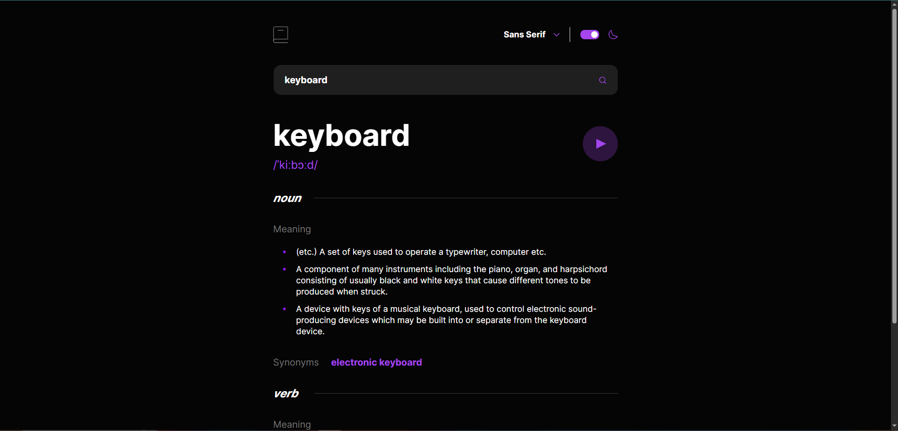
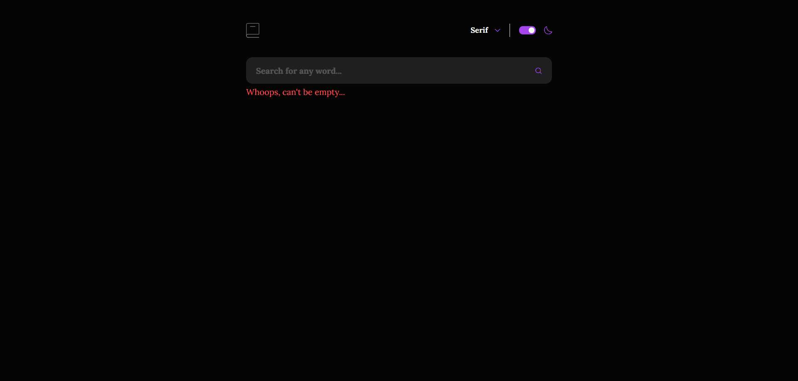
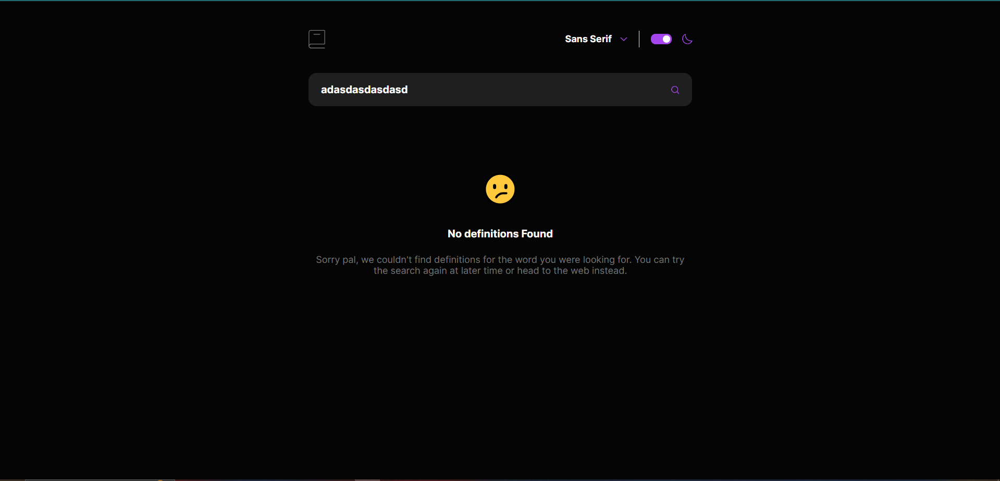

# 📘 Dictionary Web App

Este projeto é uma solução para o desafio [Dictionary Web App](https://www.frontendmentor.io/challenges/dictionary-web-app-h5wwnyuKFL) da plataforma Frontend Mentor. O objetivo era criar um dicionário em inglês com suporte a múltiplos temas, troca de fontes, busca por palavras e integração com API externa.

Link: https://tonyzcataldo.github.io/Dictionary-Challenge/

## 🛠 Tecnologias

- **HTML5 semântico**
- **JavaScript (Vanilla)**
- **SCSS (modular e organizado)**
- **BEM Methodology**

---

## ⚙️ Funcionalidades

### 🌗 Temas (Dark / Light)

- 🔍 **Detecção automática** do tema do sistema do usuário (via `prefers-color-scheme`)
- 🔁 **Botão na header** permite alternar manualmente entre os temas

### 🔤 Font Toggle

- 🔘 **Botão na header** abre um card com as opções de fontes disponíveis
- 🔄 Ao selecionar uma nova fonte:
  - O card é automaticamente ocultado
  - Toda a fonte do site é atualizada com a nova tipografia

### 📚 Busca de Palavras (API)

- 🔍 Busca realizada:

  - Ao digitar no input e pressionar a tecla `Enter`
  - Ou clicando no ícone de lupa no input

- ❌ **Validações e mensagens de erro**:

  - Impede envio se o campo estiver vazio e exibe mensagem `"Can't be empty"`
  - Se a palavra não for encontrada, exibe uma mensagem personalizada informando a ausência de definições

- ✅ **Em caso de sucesso**:

  - Exibe a **palavra pesquisada** com a **pronúncia**
  - Exibe botão de **"play"** para tocar o áudio da palavra, se disponível
  - Renderiza seções por tipo gramatical: _verb_, _noun_, _adjective_, etc.
  - Para cada seção:
    - Mostra até **6 significados**
    - Para cada significado, mostra um **exemplo** se disponível
    - Mostra até **3 sinônimos**, que são **clicáveis** e acionam nova busca

- 🔗 **Rodapé** com link direto para a palavra pesquisada no Wiktionary

---

## 🔗 API Utilizada

Os dados são consumidos da [Free Dictionary API](https://dictionaryapi.dev/), que fornece definições, fonética, exemplos, sinônimos e links para dicionários externos.

---

## 📸 Screenshot

### 🌞 Light Theme

> Visual do app com o tema claro e fonte mono.

---

### 🌙 Dark Theme

> Visual do app com o tema escuro e fonte sans-serif.

---

### ⚠️ Empty Input Error

> Visual do app com "empty error" e fonte serif.

---

### ❌ Word Not Found Error

> Visual do app com "no definitions found error" e fonte sans-serif.

---
